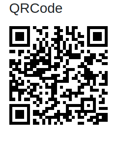

Depois de adicionar a tag de script em seu site, os métodos para criar o Visualizador 3D estarão disponíveis por meio do objeto global R2U.


## R2U.viewer.create 

:::tip `mobile` `desktop`
:::

É o método para criar o visualizador 3D no site de acordo com a posição do elemento HTML indicado. 


```typescript
  //Lembre de substituir pelas informações do seu produto

  //elemento HTML que irá receber o modelo 3D
  const element = document.getElementById('3d-viewer')
  //SKU do produto desejado
  const sku = 'RE000001'
  //nome do produto que será renderizado
  const name = 'Cadeira Eames'
  //visualizador 3D expansível 
  const popup = false
  //posição da barra de carregamento do modelo 3D
  const progressBarPosition = 'middle'
  //inserir uma imagem sobre o modelo 3D durante o carregamento do modelo
  const poster = 'https://real2u-public-assets.s3.amazonaws.com/images/cadeira.png'

  R2U.viewer.create({ element, sku, name, popup, progressBarPosition, poster })
```


### Parâmetro popup

Habilita e desabilita o botão para abrir o visualizador 3D expansível com o modelo.

<div style={{display: 'flex', flexDirection: 'column'}}>
<div>

```typescript
  interface R2U {
    viewer: {
    create: (params: {
      element: HTMLElement
      sku: string
      name?: string
      popup?: boolean
    }) => Promise<void>
  }
  }
```
</div>
<div>
  <strong> Exemplo do popup: </strong> 

 <p float="left">
    
  </p>
  </div>

</div>


### Parâmetro progressBarPosition
  Define a posição que o progress bar será inserido.

<div style={{display: 'flex', flexDirection: 'column'}}>
<div >

```typescript
  interface R2U {
    viewer: {
    create: (params: {
      element: HTMLElement
      sku: string
      progressBarPosition?: 'top' | 'middle' | 'bottom'
    }) => Promise<void>
  }
  }
```
</div>
<div style={{ marginTop: '20px'}}>
  <strong> Exemplo do progressBarPosition no desktop: </strong> 

 
<p float="left" style={{display: 'flex', flexDirection: 'row'}}>
  <div  style={{display: 'flex', flexDirection: 'column', marginLeft: '15px', marginRight: '15px'}} >
    <a>top</a>
    
  </div>
  <div  style={{display: 'flex', flexDirection: 'column'}} >
    <a>middle</a>
    
  </div>
  <div  style={{display: 'flex', flexDirection: 'column'}} >
    <a>bottom</a>
    
  </div>
</p>

  </div>

</div>

### Parâmetro progressBarColor

Define a cor do progressBarPosition

<div>

  ```typescript
    interface R2U {
      viewer: {
      create: (params: {
        element: HTMLElement
        sku: string
        progressBarColor?: string
      }) => Promise<void>
    }
    }
  ```
</div>


### Parâmetro poster

Define uma imagem sobre o modelo 3D que será exibida durante o carregamento do modelo. 

<div>
<div>

  ```typescript
    interface R2U {
      viewer: {
      create: (params: {
        element: HTMLElement
        sku: string
        poster?: string
      }) => Promise<void>
    }
    }
  ```
</div>

</div>


### Demonstração do visualizador 3D

 <p float="left">
    
  </p>

## Mudar sku R2U.viewer.create

O método setSku atualiza o SKU do produto.

<div >
<div>

  ```typescript
   // SKU de teste -- lembre de substituir pelas informações do seu produto
    const buttonChangeSku = document.getElementById('button-changeSku')
    const changeSku = document.getElementById('viewer-changeSku')

    // O create irá retornar um objeto que terá o método setSku
    const handler = R2U.viewer.create({
      element: changeSku,
      sku,
      name,
      popup,
      progressBarPosition,
      poster
    })
    //muda o sku no click do botão
    buttonChangeSku.addEventListener('click', () => {
      handler.setSku('RE000002')
    })
  ```
</div>
<div>
  <strong> Exemplo do setSku: </strong> 

  <p float="left">
    
  </p>
  
  </div>

</div>

## R2U.qrCode.create

:::danger Problemas conhecidos: Usuários Android escaneando o QR Code sem ter o browser aberto receberão uma mensagem de fallback avisando que o dispositivo não é suportado.
:::

Cria um QRCode que ao scannear direciona o usuário para o modelo em RA.

<div >
<div>

  ```typescript
    const element = document.getElementById('qrCode')
    R2U.qrCode.create({ element, sku })
  ```
</div>
<div>

  <p float="left">
    
  </p>
  </div>

</div>
