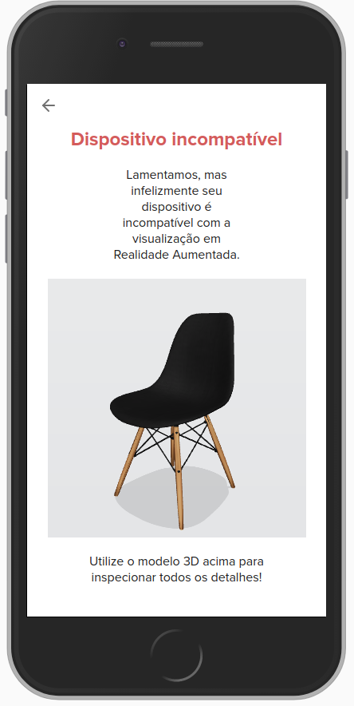

Depois de adicionar a tag de script em seu site, os métodos para criar a experiência de Realidade Aumentada estarão disponíveis por meio do objeto global R2U.


## R2U.ar.attach

:::tip `mobile`
:::

O método ar.attach cria um "eventListener" para abrir o visualizador de RA em dispositivos mobile (e.g.: clique de um botão).  

```typescript
  // SKU teste -- lembre de usar informação do seu produto
  const arButton = document.getElementById('ar-button')
  const sku = 'RE000001'
  // cria um alerta de dispositivo não compatível
  const fallbackOptions = {
    //add mensagem no alerta
    alertMessage: 'RA não suportada pelo dispositivo',
    //abre um visualizador 3D na tela de aviso
    fallback: 'viewer'
  }

  R2U.ar.attach({
    element: arButton,
    sku,
    fallbackOptions
    /* resize defaults to `false` */
  })
```

### element

É o elemento que irá ativa experiência de RA através de algum evento.  

```typescript
interface R2U {
  ar: {
    attach: (params: {
      element: HTMLElement
      sku: string
    }) => Promise<void>
  }
}

```

### SKU

É o SKU do produto que deseja ver em RA .

```typescript
interface R2U {
  ar: {
    attach: (params: {
      element: HTMLElement
      sku: string
    }) => Promise<void>
  }
}
```

### event

É o	evento que ativará experiência de RA.

```typescript
interface R2U {
  ar: {
    attach: (params: {
      element: HTMLElement
      sku: string
      event?: string
    }) => Promise<void>
  }
}
```

### resize 
Opção para redimensionar modelo 3D em experiência de RA

```typescript
interface R2U {
  ar: {
    attach: (params: {
      element: HTMLElement
      sku: string
      resize?: boolean
    }) => Promise<void>
  }
}
```


### showInstructions
:::tip  As intruções será visualizada apenas na primeira experiência de RA do usuário.
:::

  Quando verdadeiro, mostra uma imagem em tela cheia explicando como posicionar e manipular o objeto 3D em realidade aumentada antes de prosseguir para a experiência com a câmera. 
<div >
<div >

  ```typescript
  interface R2U {
    ar: {
      attach: (params: {
        element: HTMLElement
        sku: string
        showInstructions?: boolean
      }) => Promise<void>
    }
  }
  ```
</div>
<div>
<strong> Exemplo das intruções: </strong> 

<p float="left">
  
</p>
</div>
</div>


### fallbackOptions
:::tip  A mensagem do `alertMessage` pode ser customizada
:::
Mostra uma imagem quando o dispositivo móvel não suporta a experiência de RA. Se as instruções estiver inserida o fallback é visualizado apenas quando clicar no botão de "Veja na sua casa".

<div >
<div >

```typescript
  interface R2U {
    ar: {
      attach: (params: {
        element: HTMLElement
        sku: string
        //aviso de dispositivo não compatível com RA
        fallbackOptions?: {
          //add mensagem de alerta
          alertMessage?: string
          //abre um visualizador 3D na tela de aviso
          fallback?: 'viewer' | 'full'
          //modifica o texto do fallback
          text?: {
            //altera o título da página
            title?: string
            //altera o texto superior da página
            top?: string
            //altera texto inferior da página
            bottom?: string
          }
        }
      }) => Promise<void>
    }
  }
  ```
</div>
<div>
<strong> Exemplo do fallback: </strong> 

<p float="left">
  
</p>
</div>

</div>


### Demostração da RA no _iOS_

<p float="left">
  
  
  
</p>

### Desmonstração da RA no _Android_

<p float="left">
  
  
  
</p>

## R2U.ar.getlink
:::tip `mobile` `desktop`
:::

É o método retorna a URL para compartilhamento na experiência de RA. 

```typescript
  // Lembre de usar informação do seu produto
  R2U.ar.getLink('RE000001').then((url) => console.log(url))
```

