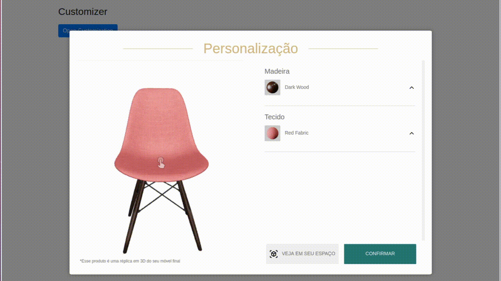

Depois de adicionar a tag de script em seu site, os métodos para criar o Customizador 3D estarão disponíveis por meio do objeto global R2U.


## R2U.viewer.create 

:::tip `mobile` `desktop`
:::

É o método para criar o customizador 3D de acordo com a posição do elemento HTML indicado. 

```typescript
  const element = document.getElementById('3d-customizer')
  const onConfirm = (productCustomization) =>
    console.log('customização escolhida', productCustomization)
  R2U.customizer.create({ element, onConfirm })
```

A função `onConfirm` é acionada após o clique do usuário no botão "Confirmar" na tela do Customizador. Ela retorna um mapa chave-valor contendo a customização do produto (ex: chave "modelo" valor "Cadeira Eames", chave "cor" valor "Preto", etc.).

<div>
  <strong> Exemplo do customizador 3D: </strong> 

  <p float="left">
    
  </p>

</div>